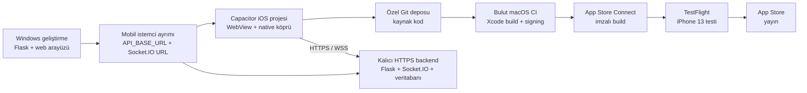

# Windows'tan iOS / IPA dönüşüm planı

## Hedef

FootballDatabase'i Windows üzerinde geliştirmeye devam edip Mac sahibi olmadan
imzalı iOS paketi üretmek, iPhone 13 üzerinde TestFlight ile test etmek ve daha
sonra App Store'a göndermek.

İlk cihaz testinde varsayılan backend adresi
`https://diving-responsibility-annex-look.trycloudflare.com` olacaktır. Mobil
başlatıcı sunucu adresini cihazda saklayıp değiştirmeye izin verir. Böylece Quick
Tunnel değiştiğinde veya `https://api.edynfootball.app` kalıcı adresine geçildiğinde
IPA'yı yalnız adres değişikliği için yeniden imzalamak gerekmez.

İlk cihaz testi için geçici sunucu adresi:
`https://diving-responsibility-annex-look.trycloudflare.com`. Bu adres uygulamanın
mobil bağlantı ekranında değiştirilebilir tutulur. Kalıcı hedef
`https://api.edynfootball.app` önceden izin listesine eklenmiştir; böylece sunucu
değişimi için IPA'nın yeniden imzalanması gerekmez.

Seçilen kalıcı adres planı:

- Ana alan adı: `edynfootball.app` — kayıt durumu bekleniyor
- Backend/API: `https://api.edynfootball.app`
- Socket.IO: `wss://api.edynfootball.app`
- Cloudflare hedefi: Named Tunnel → `http://127.0.0.1:5000`

## Önerilen mimari

İlk sürümde mevcut HTML/CSS/JavaScript arayüzü **Capacitor iOS kabuğu** içine
alınır. Bu, çalışan oyunları yeniden yazmadan native bir iOS projesi ve `.ipa`
üretmemizi sağlar. Reklam, bildirim, titreşim ve benzeri cihaz özellikleri native
Swift eklentileri üzerinden çalışır. Uzun vadede gerekirse ekranlar parça parça
SwiftUI'a taşınabilir.

Flask ve Socket.IO uygulamanın uzaktaki backend'i olarak kalır. Telefon,
`https://api...` biçimindeki sabit üretim adresine bağlanır. Cloudflare Quick
Tunnel yalnızca geliştirme testi içindir; App Store sürümü kalıcı bir backend
barındırma adresi kullanmalıdır.

## Aşamalar

### 0. Hesap ve kararlar

1. Apple Account'ta iki aşamalı doğrulamayı aç.
2. Kalıcı TestFlight ve App Store dağıtımı için Apple Developer Program'a katıl.
3. Uygulama adı ve benzersiz Bundle ID belirle; kullanılan değer:
   `app.edynfootball.mobile`.
4. Kaynak kod için özel bir Git deposu hazırla.

Seçilen depo: `https://github.com/emirdurak5934/Hex_FootBall`

Apple'ın ücretsiz Personal Team yolu cihaz profillerini yedi günde bir yenilemeyi
gerektirir ve normalde Xcode ile fiziksel cihaza yüklemeye dayanır. Mac'siz,
sürdürülebilir Windows akışı için ücretli üyelik + bulut macOS + TestFlight
önerilir.

### 1. Web istemcisini backend'den ayır

1. Frontend'deki sabit veya göreli sunucu adreslerini tek bir yapılandırma
   modülünde topla.
2. `API_BASE_URL` ve `SOCKET_URL` değerlerini geliştirme/üretim ortamına göre
   değiştirilebilir yap.
3. Oturum açma, oda kurma, rastgele eşleşme, Possession ve Tiki Taka Toe
   akışlarını uzak HTTPS/WSS sunucuyla test et.
4. Flask oturumları, CORS, güvenli cookie ve Socket.IO origin ayarlarını mobil
   uygulama kaynağına göre düzenle.

### 2. Kalıcı backend hazırlığı

1. Quick Tunnel yerine sabit alan adına sahip bir sunucu seç.
2. Flask/Socket.IO'yu üretim sunucusuyla çalıştır; tek makine içi bellek yerine
   ölçeklenebilir oda/eşleşme durumu için ileride Redis planla.
3. SQLite için yedekleme veya yönetilen veritabanına geçiş planı oluştur.
4. HTTPS, gizli anahtarlar, loglama ve sağlık kontrolü ekle.

### 3. Capacitor iOS kabuğu

1. Node.js projesi ve Capacitor yapılandırması ekle.
2. Web varlıklarının uygulama paketine kopyalanacağı dizini belirle.
3. `ios/` projesini üret; bu aşamanın macOS/Xcode gerektiren kısmı CI'da çalışır.
4. Safe Area, klavye, durum çubuğu, yönlendirme ve iPhone 13 ekranını düzelt.
5. `ads.py` politikasını native `AdService.swift` köprüsüne bağla.

### 4. Bulut macOS derleme ve imzalama

1. İlk tercih olarak GitHub Actions `macos-*` runner veya iOS odaklı bir bulut
   CI sağlayıcısı seç.
   İlk doğrulama hattı `.github/workflows/ios-validate.yml` dosyasında başlatılmıştır;
   bu hat imzasız iOS simulator build'i ile Capacitor/Xcode projesini doğrular.
2. Apple dağıtım sertifikası ve provisioning profile'ı güvenli CI secrets olarak
   tanımla; mümkünse App Store Connect API anahtarı kullan.
3. CI sırası: kaynak kodu al → Node bağımlılıkları → web build → Capacitor sync →
   CocoaPods/SPM → Xcode archive → imzala → App Store Connect'e yükle.
4. Sertifika, `.p12`, API anahtarı ve şifreleri repoya kesinlikle koyma.

### 5. iPhone 13 testi

1. Build App Store Connect'e yüklendikten sonra TestFlight'ta dahili test grubuna
   ekle.
2. iPhone'a TestFlight yükle ve davet edilen Apple Account ile build'i kur.
3. Gerçek cihazda giriş, ekran ölçüsü, bağlantı kopması, arka plana geçme,
   Socket.IO yeniden bağlanma ve iki telefonlu maçları test et.
4. Her yeni build aynı CI hattından üretilir; Windows'a Xcode kurulmaz.

Ücretsiz sideload testinde `.github/workflows/ios-unsigned-ipa.yml`, cihaz
mimarisi için imzasız `EDYN-Football-unsigned.ipa` artifact'i üretir. Windows'ta
Sideloadly bu IPA'yı ücretsiz Apple hesabıyla imzalayıp USB üzerinden telefona
kurar. Ücretsiz provisioning profile yedi gün sonra sona erdiğinden aynı Apple
hesabıyla yeniden sideload gerekir.

### İlk ücretsiz cihaz testinin sonucu — 13 Eylül 2026

- GitHub Actions simulator doğrulaması başarıyla tamamlandı.
- GitHub Actions cihaz hedefli ARM64 imzasız IPA'yı başarıyla üretti.
- IPA Windows'a indirildi ve teknik paket kontrollerinden geçti.
- Web sürümü iTunes ve iCloud, Apple Mobile Device Support, Bonjour ve
  Sideloadly kuruldu.
- iPhone 13 USB üzerinden Apple sürücüleriyle algılandı.
- IPA ücretsiz Apple hesabıyla Sideloadly üzerinden imzalandı ve telefona
  kuruldu.
- EDYN Football iPhone'da bağımsız uygulama olarak başarıyla açıldı.
- Geçici Quick Tunnel sunucusuna uygulama içinden bağlantı sağlandı.

Bu sonuç, Windows → GitHub → bulut macOS/Xcode → imzasız IPA → Windows
Sideloadly → iPhone zincirinin çalıştığını doğrular. App Store dağıtımı için
kalıcı alan adı/backend, ücretli Apple Developer üyeliği, App Store Connect
imzalama ve TestFlight aşamaları hâlâ beklemektedir.

### 6. App Store hazırlığı

1. Uygulama simgesi, ekran görüntüleri, açıklama, destek ve gizlilik adreslerini
   hazırla.
2. Privacy Manifest, veri toplama beyanları, hesap silme ve izin metinlerini
   tamamla.
3. AdMob için UMP/izin akışını ve test reklam kimliklerini doğrula; yayın öncesi
   gerçek reklam kimliklerine geç.
4. TestFlight kabul testlerinden sonra App Review'a gönder.

## Uygulama sırası ve kontrol kapıları

| Faz | Çıktı | Tamamlanma ölçütü |
|---|---|---|
| 0 | Apple/Git hesapları ve Bundle ID | Hesaplar erişilebilir |
| 1 | Yapılandırılabilir mobil istemci | Uzak sunucuda iki telefonlu maç çalışıyor |
| 2 | Kalıcı backend | Sabit HTTPS/WSS adresi ve sağlık kontrolü var |
| 3 | Capacitor iOS projesi | Mobil başlatıcı hazır; Xcode workspace bulut macOS CI'da üretilebiliyor |
| 4 | İmzalı build | App Store Connect build'i kabul ediyor |
| 5A | Ücretsiz sideload cihaz testi | Tamamlandı: EDYN Football iPhone 13'te uygulama olarak açıldı |
| 5B | TestFlight kurulumu | Ücretli geliştirici hesabıyla iPhone 13'te tam maç tamamlanıyor |
| 6 | App Store sürümü | İnceleme gereksinimleri tamamlanıyor |

## Şimdilik yapılmayacaklar

- Bütün arayüzü bir kerede SwiftUI ile yeniden yazmak.
- Quick Tunnel adresini üretim API adresi olarak kullanmak.
- Apple sertifikalarını veya API anahtarlarını kaynak kod deposuna eklemek.
- Gerçek AdMob kimliğiyle geliştirme testi yapmak.
- Apple Developer üyeliği ve dağıtım tercihi netleşmeden imzalama otomasyonu kurmak.
