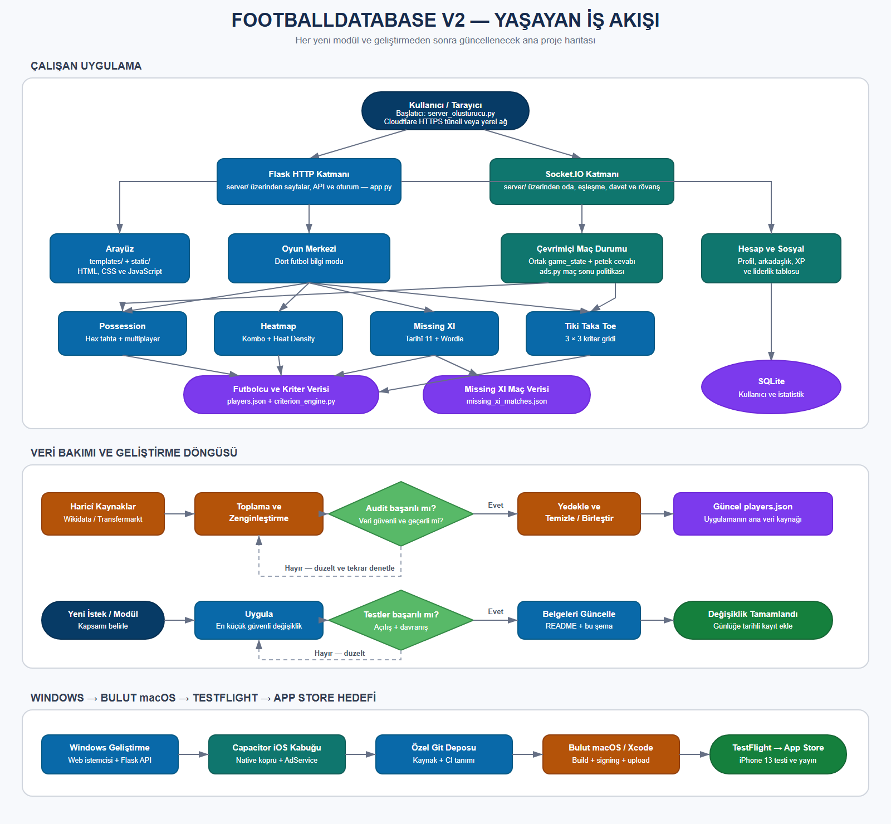
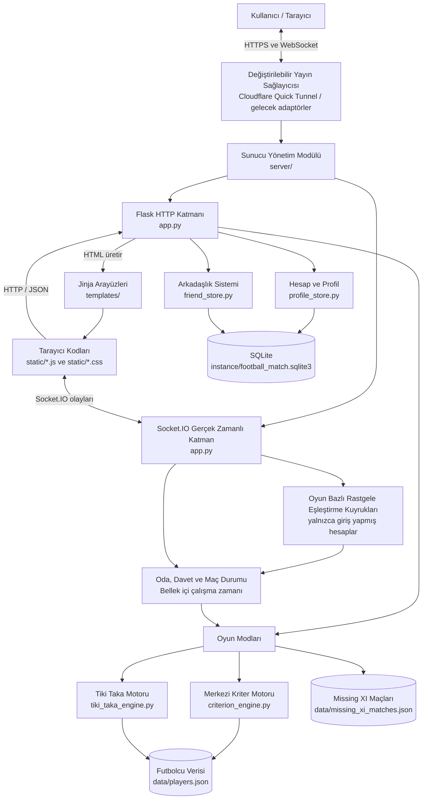
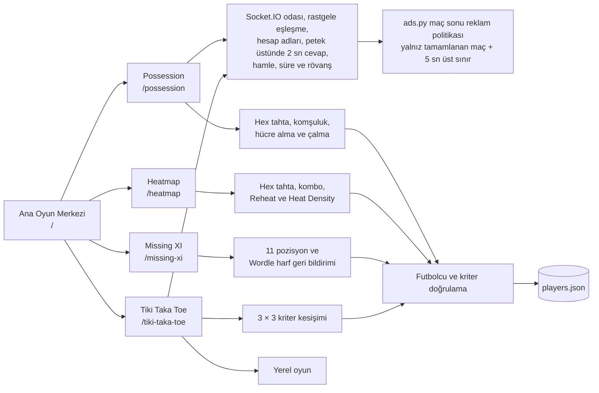
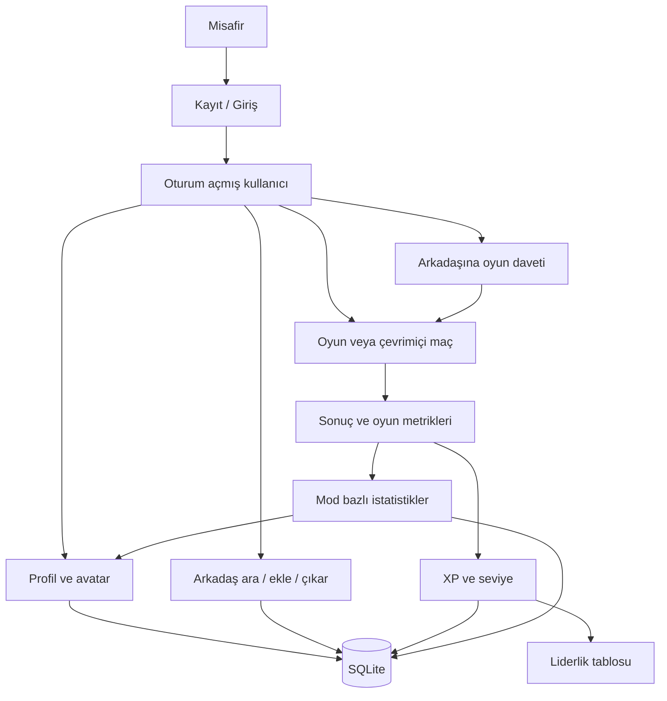
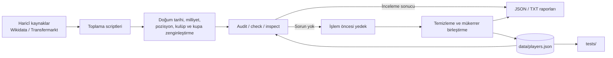
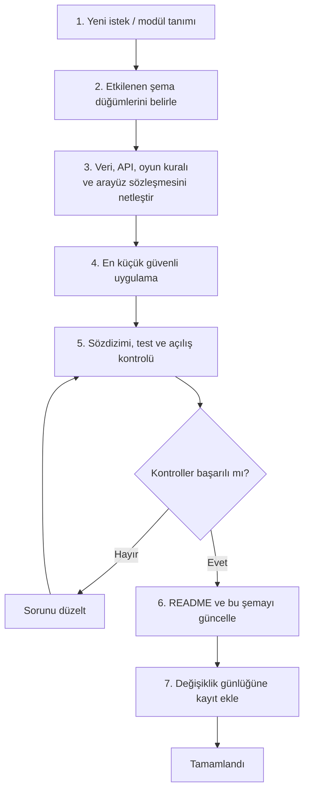
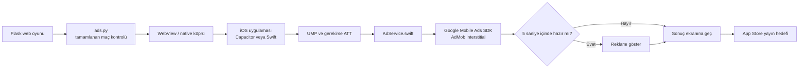
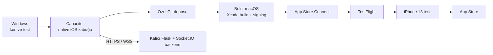

# FootballDatabase V2 — Yaşayan İş Akışı ve Mimari Şeması

Bu belge projenin ortak çalışma haritasıdır. Yeni modül, özellik, hata düzeltmesi veya mimari değişiklik tamamlandığında ilgili düğümler, bağlantılar ve değişiklik günlüğü güncellenmelidir.

Son güncelleme: 12 Eylül 2026

## Görsel ana şema

Görsel dosya `PROJECT_WORKFLOW.png` olarak doğrudan açılabilir. Düzenlenebilir vektör kaynağı `PROJECT_WORKFLOW.svg` dosyasıdır. Aşağıdaki Mermaid bölümleri ise şemanın metin tabanlı ayrıntılı kaynağıdır.

## 1. Uygulamanın ana akışı

## 2. Oyun modları

## 3. Kullanıcı, sosyal ve ilerleme akışı

## 4. Veri bakım akışı

Bu alan çalışan web uygulamasından ayrıdır. Bakım scriptleri `tools/maintenance/` altında bulunur ve proje kökünü kendi `__file__` konumlarından `os.path` ile hesaplar.

## 5. Yeni istek ve modül geliştirme akışı

Bundan sonraki talepler bu akış üzerinden ele alınacaktır.

## 6. Modül kayıt tablosu

| Alan | Ana dosyalar | Veri kaynağı | Durum |
|---|---|---|---|
| HTTP ve sayfa yönlendirme | `app.py`, `templates/` | Oturum ve oyun verileri | Aktif |
| Sunucu ve yayın yönetimi | `server/`, `run.py`, `server_olusturucu.py` | Ortam değişkenleri, sağlayıcı adaptörleri ve menülü başlatıcı | Aktif |
| Maç sonu reklam politikası | `ads.py` | Maç bitiş türü, reklam yapılandırması ve 5 saniyelik üst sınır | Altyapı aktif, canlı AdMob bekleniyor |
| iOS App Store uygulaması | `IOS_WINDOWS_IPA_PLANI.md`, `capacitor.config.json`, `mobile-shell/`, planlanan `AdService.swift` | Windows geliştirme, değiştirilebilir test sunucusu, bulut macOS/Xcode CI, kalıcı Flask backend | Geliştiriliyor |
| Gerçek zamanlı oyun | `app.py`, `static/game.js`, `static/tiki_taka.js` | Oyun bazlı eşleştirme kuyrukları ve bellek içi oda durumu | Aktif |
| Possession | `app.py`, `templates/index.html`, `static/game.js` | `players.json` | Aktif |
| Heatmap | `app.py`, `templates/heatmap.html`, `static/heatmap.js` | `players.json` | Aktif |
| Missing XI | `app.py`, `templates/missing_xi.html`, `static/missing_xi.js` | `players.json`, `missing_xi_matches.json` | Aktif |
| Tiki Taka Toe | `app.py`, `tiki_taka_engine.py`, `templates/tiki_taka.html`, `static/tiki_taka.js` | `players.json` | Aktif |
| Kriter doğrulama | `criterion_engine.py`, `league_clubs.py` | `players.json` | Aktif |
| Hesap ve profil | `profile_store.py`, `templates/profile.html` | SQLite | Aktif |
| Arkadaşlık ve davet | `friend_store.py`, `templates/friends.html`, `static/friends.js` | SQLite ve Socket.IO | Aktif |
| Liderlik tablosu | `profile_store.py`, `templates/leaderboard.html` | SQLite | Aktif |
| Veri bakımı | `tools/maintenance/` | JSON ve haricî kaynaklar | Uygulamadan ayrılmış |
| Otomatik kontroller | `tests/` | Uygulama ve test verileri | Aktif |
| Eski sürüm | `legacy/` | Eski Streamlit yaklaşımı | Arşiv |

## 7. Şema güncelleme kuralları

Her işlemden sonra:

1. Yeni modül varsa uygun Mermaid şemasına düğüm olarak eklenir.
2. Modüller arası yeni veri veya çağrı ilişkisi varsa oklarla gösterilir.
3. Dosya taşındıysa modül kayıt tablosundaki yolu değiştirilir.
4. Modülün durumu `Planlandı`, `Geliştiriliyor`, `Aktif`, `Pasif` veya `Arşiv` olarak işaretlenir.
5. Veri yapısı değiştiyse veri bakım akışı güncellenir.
6. Son güncelleme tarihi değiştirilir.
7. Aşağıdaki günlüğe kısa bir kayıt eklenir.

## 8. Değişiklik günlüğü

| Tarih | Değişiklik | Etkilenen alanlar |
|---|---|---|
| 11 Eylül 2026 | İlk yaşayan iş akışı ve mimari şeması oluşturuldu. | Tüm proje |
| 11 Eylül 2026 | Workflow, doğrudan açılabilen PNG ve düzenlenebilir SVG şemasına dönüştürüldü. | Proje dokümantasyonu |
| 11 Eylül 2026 | Çevrimiçi maç bağlantısı düzeltildi: yalnızca Possession ve Tiki Taka Toe çevrimiçi altyapıya bağlandı; Heatmap ve Missing XI tek oyunculu gösterildi. | Oyun modları, Socket.IO |
| 11 Eylül 2026 | Geliştirme sunucusu aynı Wi-Fi ağındaki mobil cihazlardan erişim için varsayılan olarak `0.0.0.0:5000` üzerinde dinleyecek şekilde ayarlandı. | Sunucu başlangıcı, mobil test |
| 12 Eylül 2026 | Possession ve Tiki Taka Toe için hesap tabanlı rastgele rakip eşleştirme eklendi; çevrimiçi maçlarda Oyuncu 1/2 yerine hesap adları gösterilmeye başlandı. | Socket.IO, Possession, Tiki Taka Toe, kullanıcı arayüzü |
| 12 Eylül 2026 | Sunucu başlatma ve dış yayın işlemleri `server/` modülüne ayrıldı; değiştirilebilir tünel sağlayıcısı sözleşmesi ve Cloudflare Quick Tunnel adaptörü eklendi. | Sunucu, dağıtım, güvenlik, workflow |
| 12 Eylül 2026 | Aynı ağ, Cloudflare dış yayın, yalnız tünel ve sistem kontrolü işlemleri için `server_olusturucu.py` menülü başlatıcısı eklendi. | Sunucu, mobil test, kullanım kolaylığı |
| 12 Eylül 2026 | Menülü sunucu başlatıcısının çift tıklamada kapanması önlendi; gerçek Cloudflare oyun adresi belirginleştirildi ve API adresinin public URL sanılması engellendi. | Sunucu, Cloudflare, kullanım kolaylığı |
| 12 Eylül 2026 | Başlatıcıya her ekranda aktif yerel/public adres gösterimi eklendi; Cloudflare URL durumu çalışan süreç kimliğiyle doğrulanarak kalıcılaştırıldı. | Sunucu, Cloudflare, durum görünürlüğü |
| 12 Eylül 2026 | Possession ve Tiki Taka Toe çevrimiçi maçlarında iki tarafın cevapları, hesap adı ve doğru/yanlış durumuyla 2 saniyelik geçici bildirim olarak gösterilmeye başlandı. | Socket.IO, çevrimiçi oyun arayüzleri |
| 12 Eylül 2026 | Possession cevap olayı petek indeksiyle genişletildi; cevap iki oyuncuda da ilgili peteğin üzerinde 2 saniye gösterilecek biçimde konumlandırıldı ve mobil önbellek sürümü yenilendi. | Possession Socket.IO, mobil arayüz |
| 12 Eylül 2026 | Possession cevap bildirimi en üst görsel katmana taşındı ve kayıp olaya karşı paylaşılan `game_state` içine de eklendi. | Possession Socket.IO, görünürlük ve teslimat |
| 12 Eylül 2026 | Possession petek bildirimi sadeleştirildi; yalnızca futbolcu adı, peteğin ölçüsüne uyarlanarak sınırlar içinde gösteriliyor. | Possession mobil arayüzü |
| 12 Eylül 2026 | Maç sonu reklam politikası `ads.py` modülüne ayrıldı; tamamlanan maçlar uygun, yarım kalan maçlar hariç ve reklam bekleme süresi en fazla 5 saniye olacak şekilde iki oyuna bağlandı. | Reklam modülü, Possession ve Tiki Taka Toe |
| 12 Eylül 2026 | App Store’da yayınlanacak iOS uygulaması hedefi eklendi; `ads.py` → native köprü → AdService → Google Mobile Ads SDK/AdMob interstitial akışı planlandı. | iOS, App Store ve reklam mimarisi |
| 13 Eylül 2026 | Mac sahibi olmadan Windows geliştirme → Capacitor → Git → bulut macOS/Xcode imzalama → TestFlight → iPhone → App Store dönüşüm planı oluşturuldu. | iOS, IPA, CI/CD, backend, TestFlight |
| 13 Eylül 2026 | Capacitor v8 bağımlılıkları ve iOS mobil başlatıcı eklendi; geçici Quick Tunnel varsayılan yapıldı, gelecekteki `api.edynfootball.app` adresi yeniden imza gerektirmeden cihazdan değiştirilebilir tasarlandı. | iOS, Capacitor, sunucu yapılandırması |
| 13 Eylül 2026 | GitHub macOS runner üzerinde Capacitor iOS projesi üretip imzasız simulator build'i doğrulayan ilk CI iş akışı eklendi; yerel kullanıcı verileri ve gereksiz veri yedekleri Git kapsamından çıkarıldı. | GitHub, iOS CI, güvenlik, depo boyutu |
| 13 Eylül 2026 | Hedef kaynak deposu `emirdurak5934/Hex_FootBall` olarak kaydedildi; ilk commit yerelde hazırlandı, GitHub kimlik doğrulaması kullanıcı oturumunda tamamlanmayı bekliyor. | GitHub, kaynak kontrolü, iOS CI |
| 13 Eylül 2026 | İlk IPA testi için değiştirilebilir mobil sunucu bağlantı ekranı ve Capacitor v8 yapılandırması eklendi; geçici Quick Tunnel varsayılan, `api.edynfootball.app` kalıcı hedef olarak izin listesine alındı. | Capacitor, iOS istemcisi, sunucu yapılandırması |
| 13 Eylül 2026 | Kalıcı backend adresi için `edynfootball.app` alan adı ve `https://api.edynfootball.app` API/Socket.IO adresi seçildi; alan adı kaydı bekleniyor. | DNS, Cloudflare Named Tunnel, iOS yapılandırması |

## 9. iOS App Store ve reklam hedefi

Temel kural: reklam yalnızca normal tamamlanan maçlarda denenir. Maç sonucu reklamdan önce kaydedilir; reklam bulunamaz, gösterilemez veya 5 saniye içinde hazır olmazsa kullanıcı engellenmeden sonuç ekranına geçer.

## 10. Windows'tan IPA üretim hedefi

Ayrıntılı kararlar, fazlar ve kabul ölçütleri `IOS_WINDOWS_IPA_PLANI.md` dosyasındadır.
